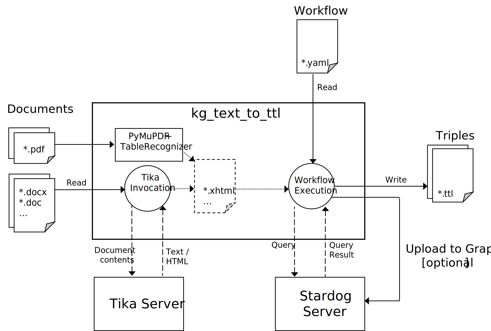

# Text to TTL 

Extraction of key semantic properties from documents (Text,HTML,PDF, Word, Excel and others)
as turtle (*.ttl) files, orchestrated by property extaction workflows in the YAML format.

Text to TTL is designed to be used in diffrent contexts:

- As a library in stand-alone Python applications.

- As a library in cloud components, e.g. AWS Lambda functions.
  *It allow to provide document data reading and result data writing strategies.*

- As a command line tool.   
  *It comes with a runner object and a main-line so that it becomes a callable module.*
  

# Architecure

